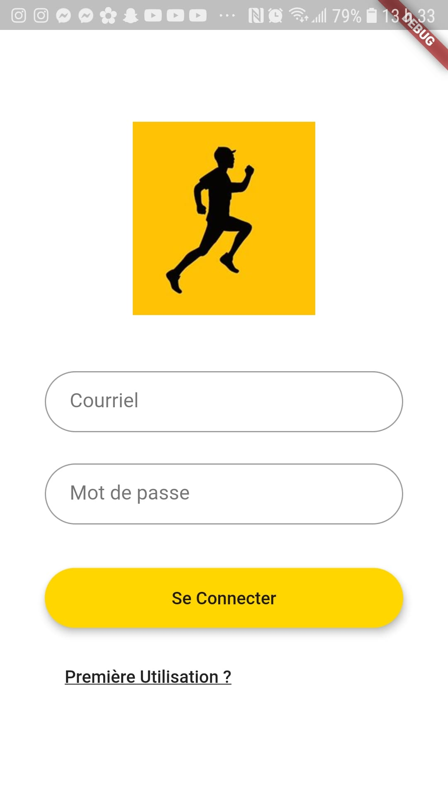
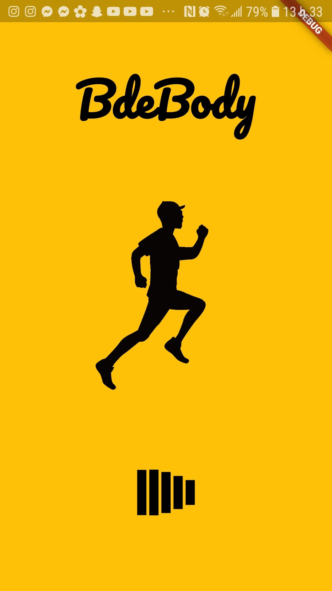
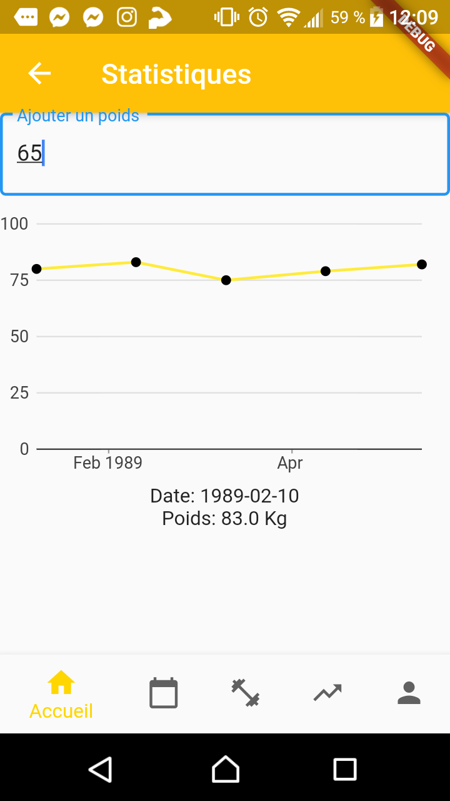
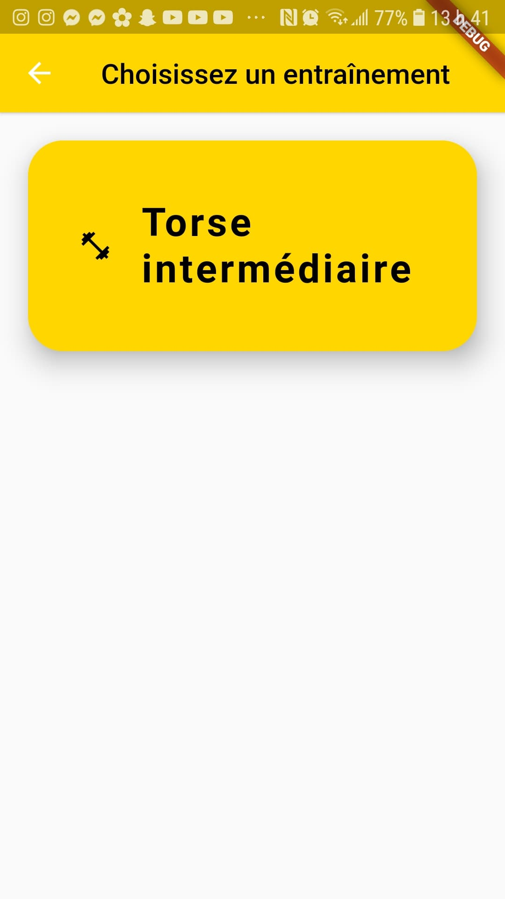
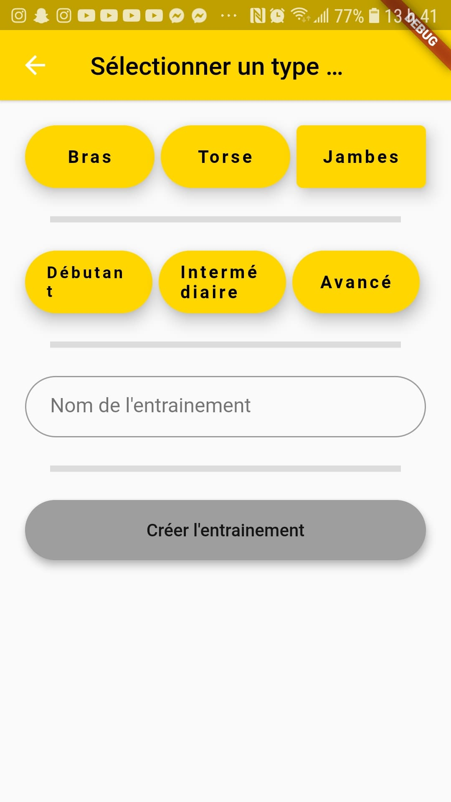
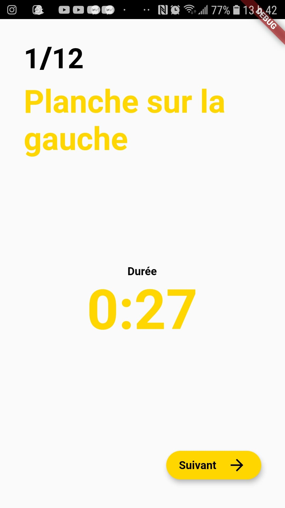
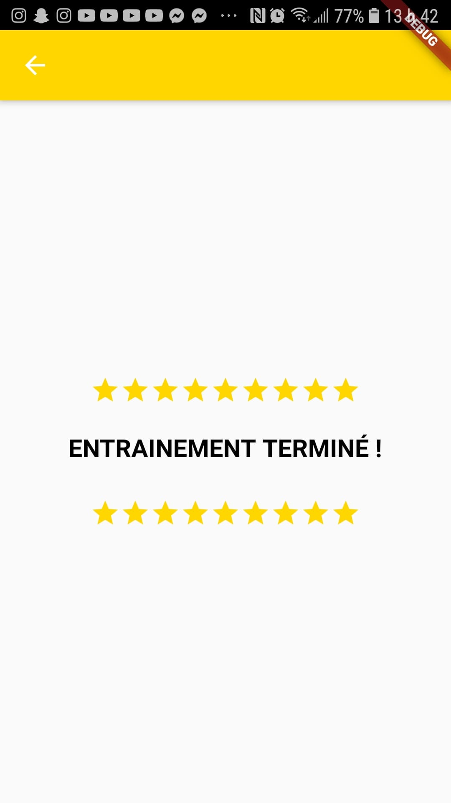

# BdeBODY
 BdeBODY est une application d'entrainement physique pour téléphone intelligent conçue par quatre étudiants au niveau collégial dans le programme de sciences informatique et mathématiques du Collège de Bois de Boulogne. Cette application a été conçue par ces étudiants dans l'optique de finaliser et de valider leurs connaissances acquise aucour de leurs deux dernières années d'étude dans le cadre de leur projet d'intégration. Le sport étant très efficace pour réduire le stress, cette application permet aux étudiants de réduire leur stress, tout en les aidant à mieux organiser leur temps d'études et du travail rémunéré qu'ils font, mais aussi elle les aide à améliorer leur bien être.
 ## Aspect visuel
          

 ## Installation
 - Installer le apk sur votre téléphone
 - Dans MariaDB, créer une base de données nommée "bdebody" pour un utilisateur nommé "user" dont le mot de passe est "test" :
  ```mysql
 mysql -u root -p
CREATE DATABASE bdebody;
GRANT ALL ON bdebody.* to 'user' IDENTIFIED BY 'test';
FLUSH PRIVILEGES;
```
 - Importer la base de données MySQL dans MariaDB à partir du fichier bdebody.sql dans ce package :
 ```bash
 mysql -u user -p bdebody < bdebody.sql
```
- Ouvrir le dossier "serverNode" de ce package dans le Windows PowerShell (ou equivalent) et exécuter la commande suivante pour démarrer le server :
```bash
npm start
```
 ## Usage
  L'usage de BdeBODY est très simple. Après l'inscription à la première utilisation de l'application, l'utilisateur peut se donner un objectif concernant une condition physique tout en fixant une date d'échéance pour l'atteindre , cet objectif peut s'agir de perdre de poids, d'en gagner, d'améliorer l'endurance aérobique etc... Des series d'exercices seront personnalisées pour atteindre ces objectifs

 ## Contribution
 Toute contribution pour améliorer BdeBODY est la bienvenue. Cependant, pour effectuer un changement, majeur veuillez d'abord nous reporter un problème que vous avez rencontrez afin d'en discuter.

 ## Auteurs et reconnaissance
 BdeBODY a été conçu par Marc-Antoine Hien, Vincent Richard, Karl-Éli Abari et Mohamed Rachid Cherif, quatre étudiants du collège de Bois de Boulogne dans le programme de sciences informatique et mathématiques. Quatre étudiants soucieux du bien être de tous les étudiants, ils ont conçu cette application pour aider les étudiants d'organiser leur temps d'etude et de travail pour réduire leur stress. Enfin un grand remerciement à Raouf Babari, enseignant de programmation d'avoir guider ce groupe en lui fournissant les informations nécessaire pour realiser BdeBODY 
